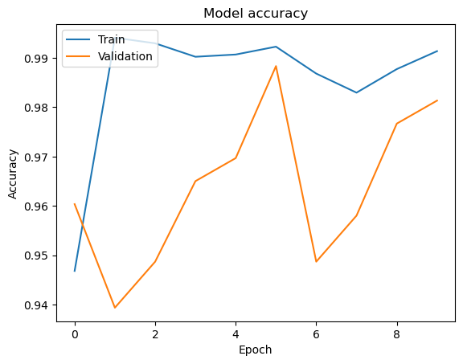
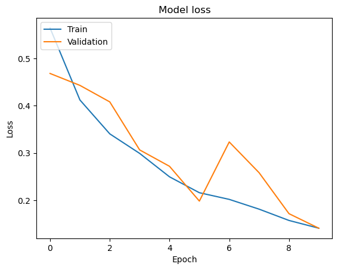
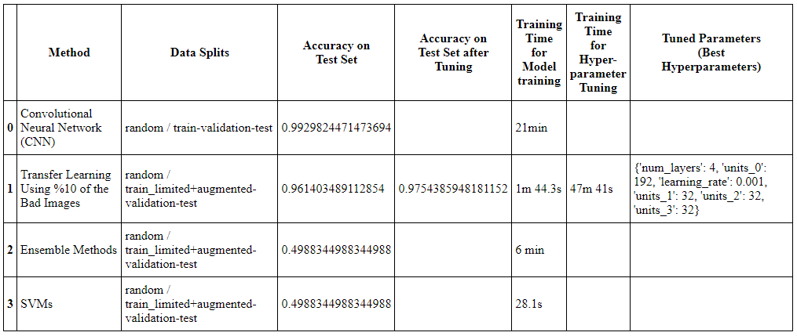

# AI-image-classification-Good-Bad

_This is a project to classify images from QA dataset from the AI4IM project._

Using QA camera images of injection moulded products.

The data set consists of QA images of (a part of the) products taken by 4 different cameras, from 4 different directions.

- The training images are labelled (grouped in different folders, by camera; good or bad).

---





---



---

---

## to use locally; conda environment setup env_tf

### Tensorflow GPU on Windows Native

https://www.tensorflow.org/install/pip#windows-native:

```
conda create --name condaenv-tf python=3.9
conda activate condaenv-tf

conda install -c conda-forge cudatoolkit=11.2 cudnn=8.1.0
pip install --upgrade pip
```

### Anything above 2.10 is not supported on the GPU on Windows Native

```
pip install "tensorflow<2.11"
```

### Verify the GPU setup:

```
python -c "import tensorflow as tf; print(tf.config.list_physical_devices('GPU'))"
```

### Should return something like:

```
[PhysicalDevice(name='/physical_device:GPU:0', device_type='GPU')]
```
